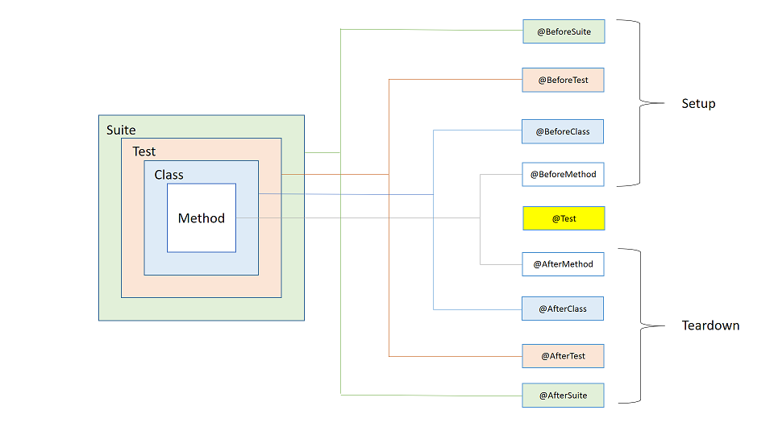

#TestNG
## Introduction
TestNG is a testing framework inspired from JUnit and NUnit. It eliminates the limitations of the older framework by providing more powerful and flexible test cases with help of easy annotations, grouping, sequencing and parameterizing.
## TestNG Annotations

## @test
|-----|------|
|alwaysRun|	If set to true, this test method will always be run even if it depends on a method that failed.|
|dataProvider|	The name of the data provider for this test method.|
|dataProviderClass|	The class where to look for the data provider. If not specified, the data provider will be looked on the class of the current test method or one of its base classes. If this attribute is specified, the data provider method needs to be static on the specified class.|
|dependsOnGroups|	The list of groups this method depends on.|
|dependsOnMethods|	The list of methods this method depends on.|
|description|	The description for this method.|
|enabled|	Whether methods on this class/method are enabled.|
|expectedExceptions|	The list of exceptions that a test method is expected to throw. If no exception or a different than one on this list is thrown, this test will be marked a failure.
groups	The list of groups this class/method belongs to.|
|invocationCount|	The number of times this method should be invoked.|
|invocationTimeOut|	The maximum number of milliseconds this test should take for the cumulated time of all the invocationcounts. This attribute will be ignored if invocationCount is not specified.|
|priority|	The priority for this test method. Lower priorities will be scheduled first.|
|successPercentage|	The percentage of success expected from this method|
|singleThreaded|	If set to true, all the methods on this test class are guaranteed to run in the same thread, even if the tests are currently being run with parallel="methods". This attribute can only be used at the class level and it will be ignored if used at the method level. Note: this attribute used to be called sequential (now deprecated).|
|timeOut|	The maximum number of milliseconds this test should take.|
|threadPoolSize|	The size of the thread pool for this method. The method will be invoked from multiple |threads| as specified by invocationCount.|
Note: this attribute is ignored if invocationCount is not specified